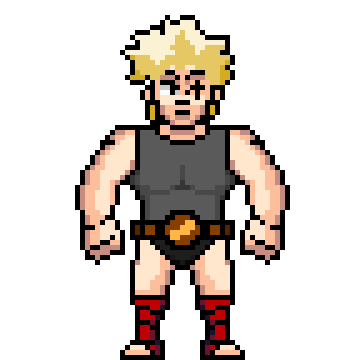

# Digital Fight Club

Welcome to the Digital Fight Club \(DFC\). Unlike another popular fight club you may have heard of - you are very much allowed to talk about the DFC \(we actually encourage it\).

Our mission is to give you the keys to your very own MMA gym. Allowing you to recruit, train, and fight with your fighters to win real money.

Initially, the DFC will be a text-based strategy fighting game. You will not have any specific control over your fighter once the fight starts. It's your job to put your fighter in the best position through training, sparring, style & opponent selection. Once that is set, it's up to your fighter to finish the job.

You will have the ability to enter your fighters into bouts \(some free, some paid\) to **earn real ETH**.

This will be a constant work in progress as we look to continually deliver new features/mechanics to make the DFC as real as possible.

Our endgame is to have an arena in {insert your favorite metaverse} where everyone can come watch their fighters match up "live."

