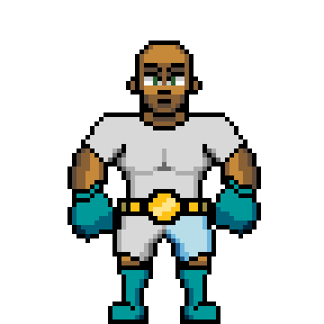

# The Fighters

There will be 9,999 \(and no more\) 'OG' fighters minted directly from [digitalfightclub.io](http://digitalfightclub.io). After that, all secondary sales will take place on [OpenSea](https://opensea.io/).

We will introduce a [**Recruiting**](recruiting.md) mechanic that will bring new fighters into the mix, but rest assured there will be benefits unique to the OG fighters \(more on this below\).

When you mint a fighter, they will automatically be assigned [**Traits**](traits.md) & [**Skills**](skills.md)**.** Some of these you'll be able to improve, some of these will be locked. Minting an OG fighter will also give you 100 [**$DFC**](usddfc-in-progress.md) tokens per fighter which will be used in [**Training** & **Sparring**](training-and-sparring.md)**.**

\*\*\*\*[**Traits**](traits.md), [**Skills**](skills.md) and [**Styles**](styles-in-progress.md) all work together for each fight. A basic example, if a fighter has relatively low Reflex \(trait\), Power \(trait\), and Kickboxing \(skill\) we wouldn't recommend selecting a [**Style**](styles-in-progress.md) along the lines of {Counter Strike}. Not to say it's impossible for a fighter to win going down this path, but a lot has to break in their favor.

Fighters will ultimately be split up across multiple organizations and weight classes to compete in so that the competition remains relatively equitable. If a fighter starts tearing it up in one organization, don't be surprised if they get called up to the next division to compete for even bigger prizes.

