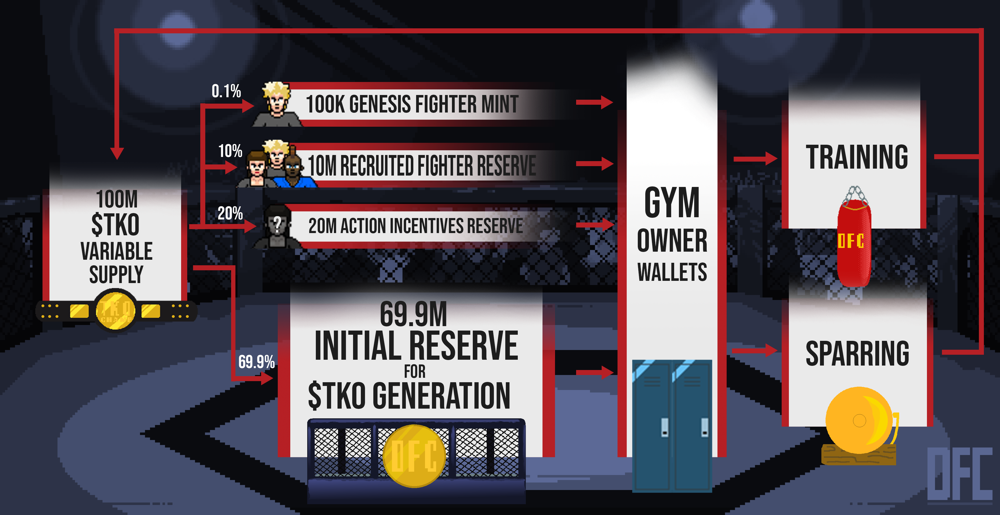

# 🪙 $TKO


**The value of 1 $TKO is 1 $TKO, any liquidity pools that may exist on exchanges were not established by the DFC brand.**


$TKO is the Digital Fight Club's currency token. The initial plan for $TKO tokens will be for use in the [**Training & Sparring**](training-and-sparring.md) mechanics. $TKO tokens can be used to improve your fighter's [**Skills** ](the-fighters/skills.md)and **** [**Traits**](the-fighters/traits.md).

Each Fighter minted will grant you 100 $TKO. $TKO is also generated passively by holding Fighters. Active Fighters generate 10 $TKO per day for your Gym. Retired Fighters generate $TKO based on their record in the DFC:

| Win Percentage    | $TKO per day |
| ----------------- | ------------ |
| Less than 25%     | 2.5          |
| Between 25% - 50% | 5            |
| Between 50% - 75% | 7.5          |
| Over 75%          | 10           |


Generated $TKO is delivered to all holder-wallets on the last day of the month. If you sell your Fighter during the month, whoever is holding the Fighter at 12:01am CST on the last day of the month will **receive all $TKO generated for that month.** As we get closer to $TKO being used on a daily basis we will revamp so holders receive a pro-rated amount based on their time of ownership.


In an ideal world - no $TKO will ever need to be minted beyond the initial 100M supply.  The goal is to fund Fighter $TKO generation - and recruited Fighter $TKO - through $TKO collected with the [**Training & Sparring**](training-and-sparring.md) **** mechanics. Technically we do need to leave the supply variable in the scenario in which Gym owners hold more $TKO than they spend and additional $TKO must be minted to meet our stated obligations.

Additional $TKO **will not be minted** beyond the 100M initial supply until one of the following:

* The 79.9M Initial Reserve is down to 10% of the initial value (or the reserves cannot handle the next $TKO payout).
* The 10M Recruited Fighter Reserve is down to 10% of the initial value.

If one of these thresholds is hit, $TKO will be minted to get back to 50% of the original balance.

We plan to re-supply the Action Incentives Reserve bucket from $TKO collected through [**Training & Sparring**](training-and-sparring.md) **** as well. We'll be using the Action Incentives Reserve for a myriad of reasons to grow the community. Including, but not limited to:

* Giveaways/Contests
* Fight Prize Pools
* Discord Boosters
